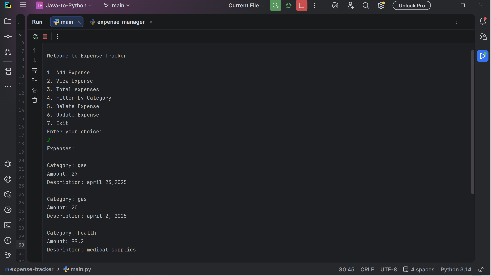
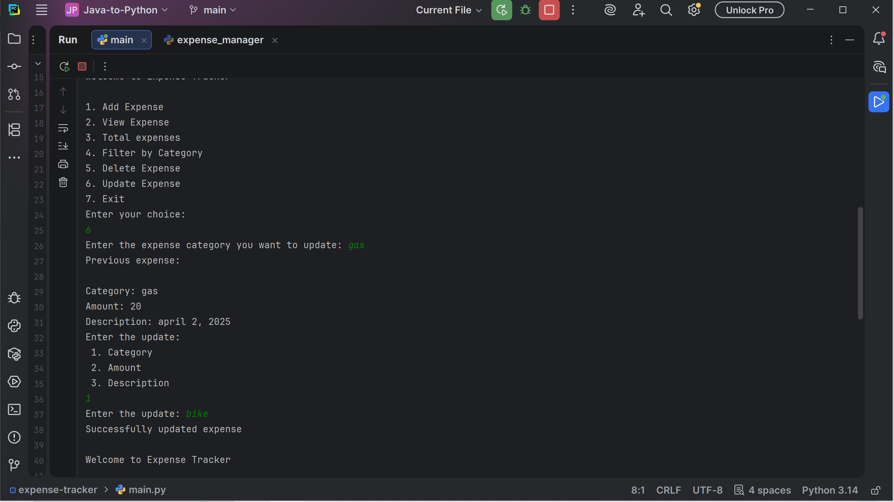
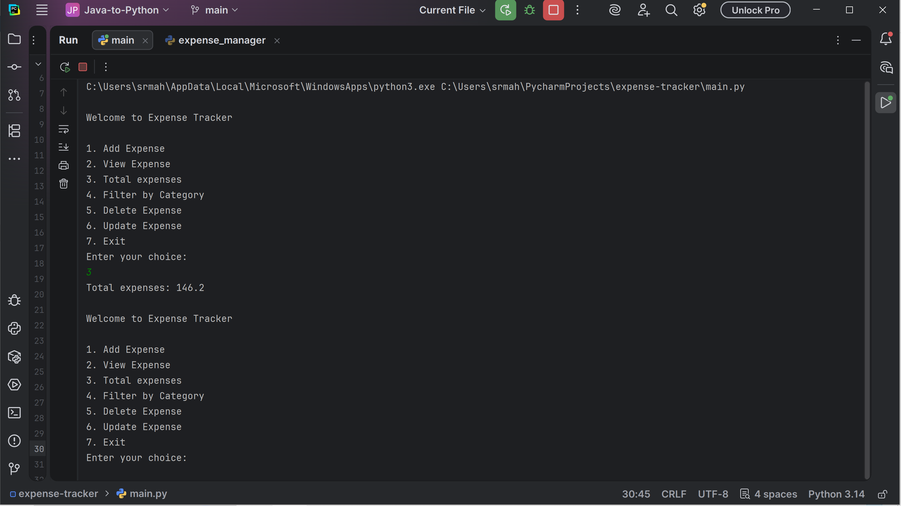
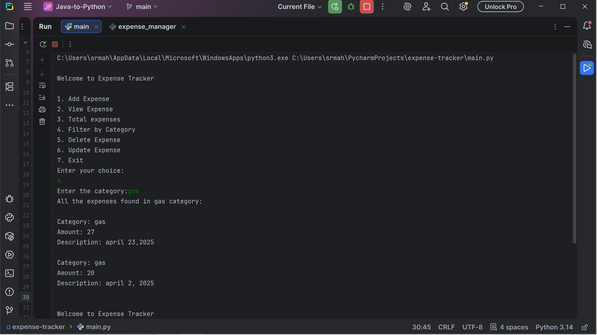

# Expense Tracker System

## Overview
CLI-based expense tracking application built using Python with JSON persistence.

## Features
- Add, view, update, delete expenses
- Category-based filtering
- Total expense calculation
- Data stored in JSON file

## Technologies
- Python
- JSON

## How to Run
1. Run main.py
2. Use menu options

## Example
Add → View → Filter → Update → Delete

## Screenshots

